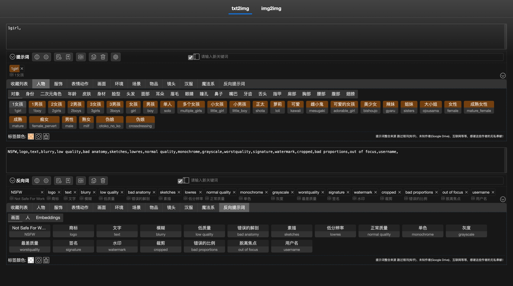

# sd-webui-prompt-all-in-one-app

<div align="center">

### [🇺🇸 English](README.MD) | [🇨🇳 简体中文](README_CN.MD)

</div>

This project is an independent version of [sd-webui-prompt-all-in-one](https://github.com/physton/sd-webui-prompt-all-in-one) that does not require the [stable-diffusion-webui](https://github.com/AUTOMATIC1111/stable-diffusion-webui) environment. It allows you to write and maintain your prompts in a web interface.



----

> If you find this extension helpful, please give it a star on GitHub!
> You can also buy me a coffee: [donate](#捐赠)

----

- [Development Plan](#development-plan)
- [Running with Docker](#running-with-docker)
- [Running Manually](#running-manually)
- [Donation](#donation)

## Development Plan

- [x] Running with Docker
- [ ] Windows, MacOS, Linux standalone app

## Running with Docker

### Run

- Run using the command line
  ```bash
  docker run -d \
  -p 17860:17860 \
  -e APP_PORT=17860 \
  -v ./dockertest/storage:/app/sd-webui-prompt-all-in-one/storage \
  -v ./dockertest/models:/app/sd-webui-prompt-all-in-one/models \
  -v ./dockertest/tags:/app/sd-webui-prompt-all-in-one/tags \
  physton/sd-webui-prompt-all-in-one-app
  ```

- Run using docker-compose
  1. Create a `docker-compose.yml` file
  ```yaml
  version: '3.7'
  services:
    sd-webui-prompt-all-in-one-app:
      image: physton/sd-webui-prompt-all-in-one-app
      container_name: sd-webui-prompt-all-in-one-app
      restart: always
      ports:
        - 17860:17860
      environment:
        - APP_PORT=17860
      volumes:
        - ./dockertest/storage:/app/sd-webui-prompt-all-in-one/storage
        - ./dockertest/models:/app/sd-webui-prompt-all-in-one/models
        - ./dockertest/tags:/app/sd-webui-prompt-all-in-one/tags
  ```
  2. Start
  ```bash
  docker-compose up -d
  ```

### Access
[http://localhost:17860](http://localhost:17860)

### Environment Variables
| Parameter | Description | Default Value |
|:-----------:| :----: | :----: |
| APP_PORT | Server port | 17860 |

### Mounted Directories
| Directory | Description |
|:-----------:|:-----:|
| /app/sd-webui-prompt-all-in-one/storage | Storage directory |
| /app/sd-webui-prompt-all-in-one/models | Model directory |
| /app/sd-webui-prompt-all-in-one/tags | CSV directory |

## Running Manually

1. Install [Python](https://www.python.org/downloads/) 3.9+.
   > Please search for installation tutorials and add Python to the environment variables.
2. Download this project to your local machine.
   - Option 1: Download using git clone (requires Git installed on your computer)
     ```bash
     git clone git clone https://github.com/Physton/sd-webui-prompt-all-in-one-app.git --recurse-submodules
     ```
     > Please note that this project uses submodules, so please use the `--recurse-submodules` parameter to download this project.
   - Option 2: Manual Download: [Latest release](https://github.com/Physton/sd-webui-prompt-all-in-one-app/releases/latest/download/sd-webui-prompt-all-in-one-app.zip) and unzip it.
4. Open the system command line (terminal) and navigate to the project directory.
   ```bash
   cd sd-webui-prompt-all-in-one-app
   ```
4. Install dependencies.
   ```bash
   pip3 install -r requirements.txt
   python install.py
   ```
5. Run the application.
   ```bash
   python app.py
   ```
6. Access [http://localhost:17860](http://localhost:17860)

## Donation

[Donation List](https://aiodoc.physton.com/zh-CN/Donate.html)

### Buy Me a Coffee

| ko-fi (EN) | [](https://ko-fi.com/physton) |
|:-----------:| :----: |
| Paypal (EN) | [https://paypal.me/physton](https://paypal.me/physton) |
| 爱发电 (CN) | [https://afdian.net/a/physton/thank](https://afdian.net/a/physton/thank) |
| 支付宝 (CN) |  |
| 微信赞赏 (CN) |  |