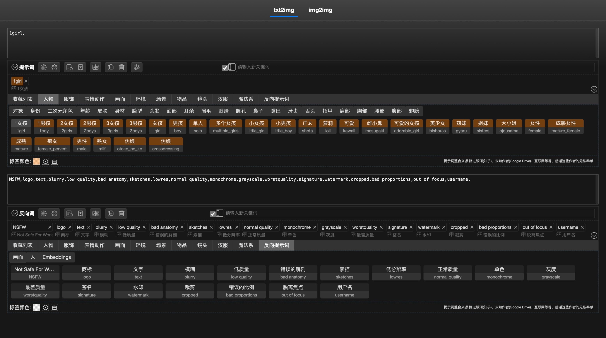

# sd-webui-prompt-all-in-one-app

<div align="center">

### [🇺🇸 English](README.MD) | [🇨🇳 简体中文](README_CN.MD)

</div>

本项目是 [sd-webui-prompt-all-in-one](https://github.com/physton/sd-webui-prompt-all-in-one) 的独立版本，它不需要依赖 [stable-diffusion-webui](https://github.com/AUTOMATIC1111/stable-diffusion-webui) 环境，即可在网页中编写和维护你的提示词。



----

> 如果你觉得这个扩展有帮助，请在Github上给我一颗星！
> 你也可以请我喝杯咖啡: [donate](#捐赠)

----

- [Windows 一键启动](#windows-一键启动)
- [Docker 运行](#docker-运行)
- [手动运行](#手动运行)
- [捐赠](#捐赠)

## Windows 一键启动

1. 前往 [Releases](https://github.com/Physton/sd-webui-prompt-all-in-one-app/releases)，根据你的系统下载对应的压缩包。
  - x64: [sd-webui-prompt-all-in-one-app.windows-x64.zip](https://github.com/Physton/sd-webui-prompt-all-in-one-app/releases/latest/download/sd-webui-prompt-all-in-one-app.windows-x64.zip)
  - x86: [sd-webui-prompt-all-in-one-app.windows-x86.zip](https://github.com/Physton/sd-webui-prompt-all-in-one-app/releases/latest/download/sd-webui-prompt-all-in-one-app.windows-x86.zip)
2. 解压压缩包，双击 `startup-windows.bat` 启动。
3. 第一次启动会自动安装依赖，需要等待一段时间。
4. 启动成功后，使用浏览器访问 [http://localhost:17860](http://localhost:17860)

> 如果你是中国大陆用户，可能因为网络原因无法正常安装依赖，可以尝试通过下面方法修改镜像源，然后再次运行 `startup-windows.bat` 启动。
> 1. 使用记事本编辑 `startup-windows.bat` 文件
> 2. 找到 `pip install -r requirements.txt` 这一行
> 3. 将其修改为 `pip install -r requirements.txt -i https://pypi.mirrors.ustc.edu.cn/simple`
> 4. 保存并关闭文件，再次运行 `startup-windows.bat` 启动

## Docker 运行

### 运行

- 使用命令行运行
  ```bash
  docker run -d \
  -p 17860:17860 \
  -e APP_PORT=17860 \
  -v ./dockertest/storage:/app/sd-webui-prompt-all-in-one/storage \
  -v ./dockertest/models:/app/sd-webui-prompt-all-in-one/models \
  -v ./dockertest/tags:/app/sd-webui-prompt-all-in-one/tags \
  physton/sd-webui-prompt-all-in-one-app
  ```

- 使用 docker-compose 运行
  1. 新建 `docker-compose.yml` 文件
  ```yaml
  version: '3.7'
  services:
    sd-webui-prompt-all-in-one-app:
      image: physton/sd-webui-prompt-all-in-one-app
      container_name: sd-webui-prompt-all-in-one-app
      restart: always
      ports:
        - 17860:17860
      environment:
        - APP_PORT=17860
      volumes:
        - ./dockertest/storage:/app/sd-webui-prompt-all-in-one/storage
        - ./dockertest/models:/app/sd-webui-prompt-all-in-one/models
        - ./dockertest/tags:/app/sd-webui-prompt-all-in-one/tags
  ```
  2. 启动
  ```bash
  docker-compose up -d
  ```

### 访问
[http://localhost:17860](http://localhost:17860)

### 环境变量
| 参数 | 说明 | 默认值 |
|:-----------:| :----: | :----: |
| APP_PORT | 服务端口 | 17860 |

### 挂载目录
| 目录 |  说明   |
|:-----------:|:-----:|
| /app/sd-webui-prompt-all-in-one/storage | 存储目录  |
| /app/sd-webui-prompt-all-in-one/models | 模型目录  |
| /app/sd-webui-prompt-all-in-one/tags | CSV目录 |


## 手动运行

1. 安装 [python](https://www.python.org/downloads/) 3.9+
  > 请自行搜索安装教程，并将 python 添加到环境变量
2. 下载本项目到本地。
  - 方式一：使用 git clone 下载（你的电脑上需要安装 git）
    ```bash
    git clone https://github.com/Physton/sd-webui-prompt-all-in-one-app.git --recurse-submodules
    ```
    > 请注意，本项目使用了子模块，所以请使用 `--recurse-submodules` 参数下载本项目
  - 方式二：手动下载：[sd-webui-prompt-all-in-one-app.zip](https://github.com/Physton/sd-webui-prompt-all-in-one-app/releases/latest/download/sd-webui-prompt-all-in-one-app.zip) 并解压。
3. 打开系统命令行（终端），进入本项目目录
  ```bash
  cd sd-webui-prompt-all-in-one-app
  ```
4. 安装依赖
  ```bash
  pip3 install -r requirements.txt
  python install.py
  ```
5. 运行
  ```bash
  python app.py
  ```
6. 访问 [http://localhost:17860](http://localhost:17860)

## 捐赠

[捐赠列表](https://aiodoc.physton.com/zh-CN/Donate.html)

### 请我喝杯咖啡

| Buy me a coffee (EN) | [](https://buymeacoffee.com/physton) |
|:-----------:| :----: |
| ko-fi (EN) | [](https://ko-fi.com/physton) |
| Paypal (EN) | [https://paypal.me/physton](https://paypal.me/physton) |
| 爱发电 (CN) | [https://afdian.net/a/physton/thank](https://afdian.net/a/physton/thank) |
| 支付宝 (CN) |  |
| 微信赞赏 (CN) |  |